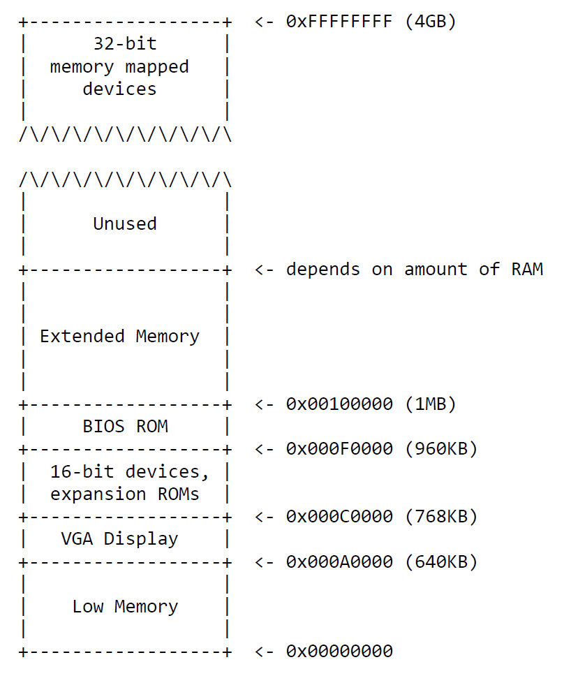
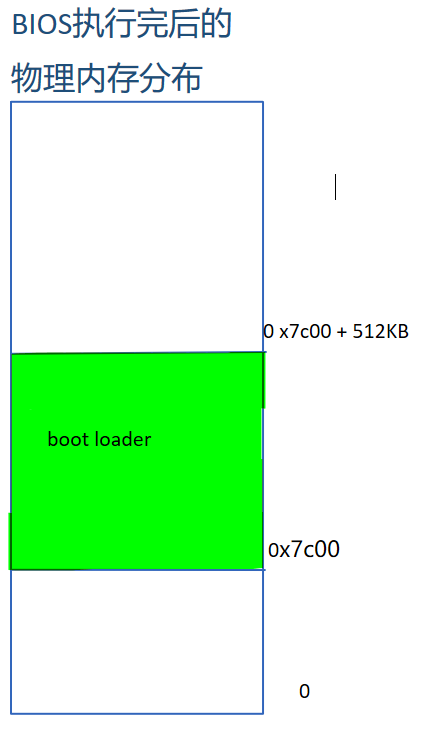
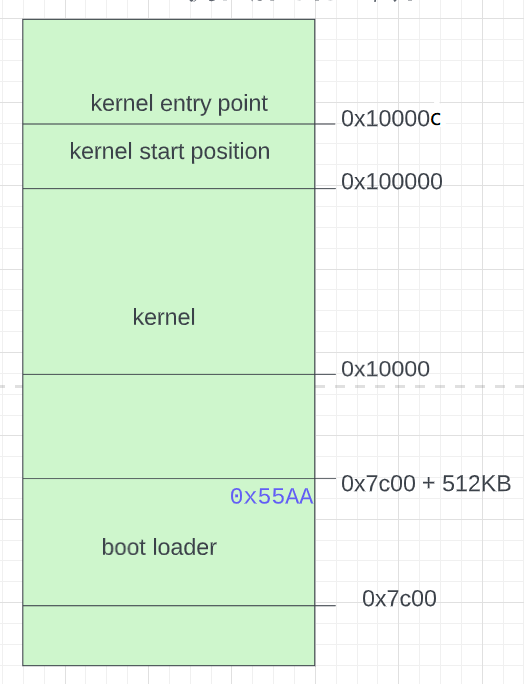
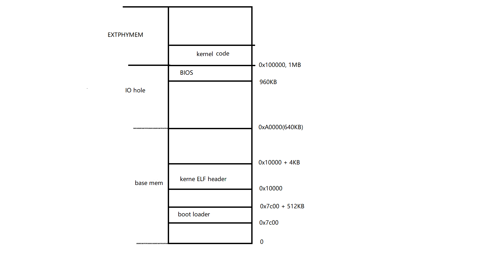
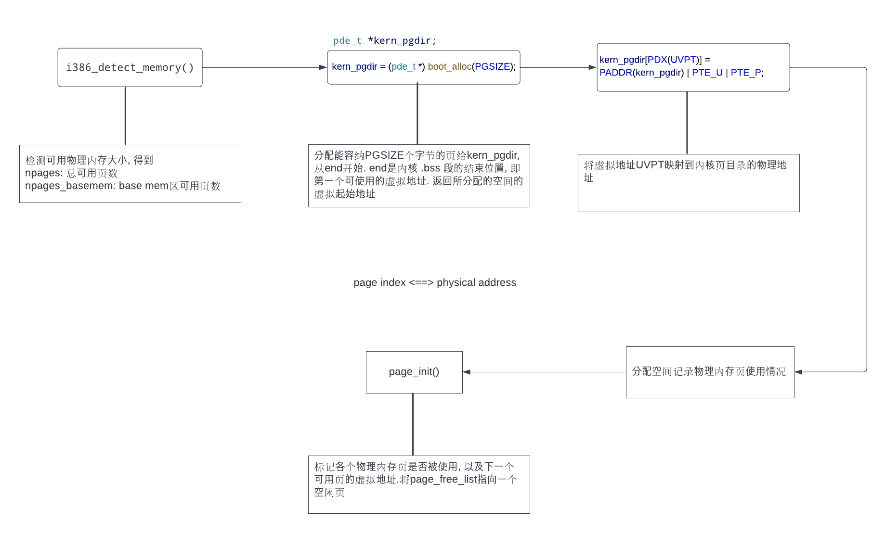
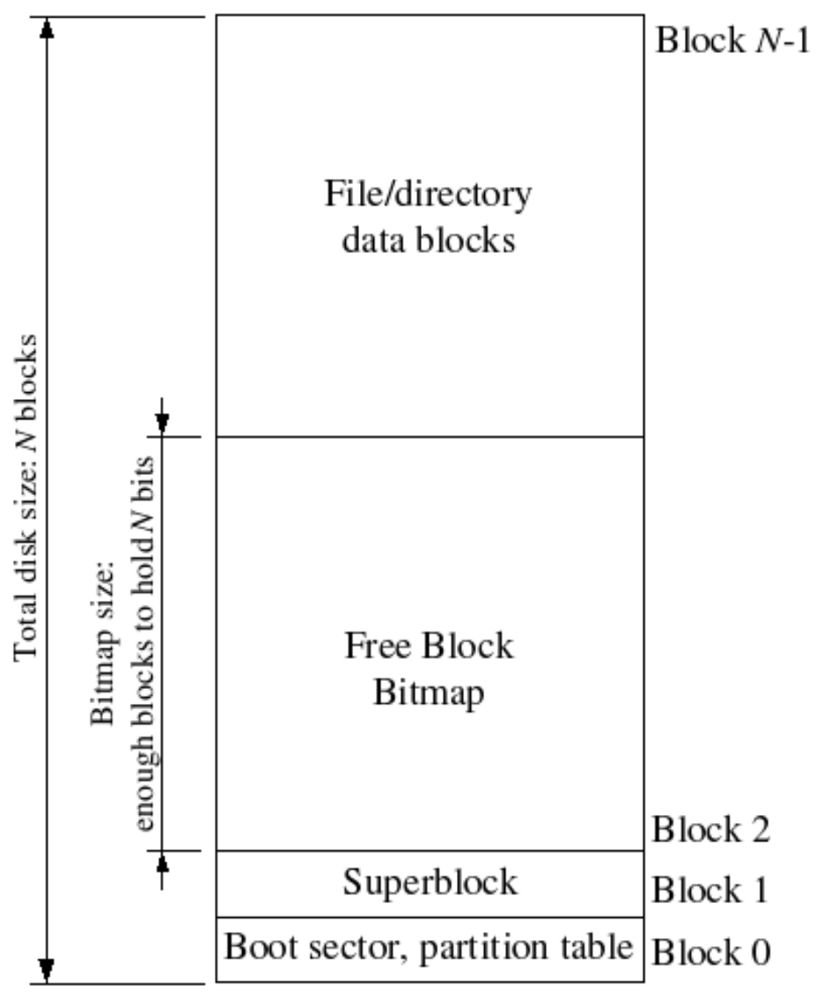
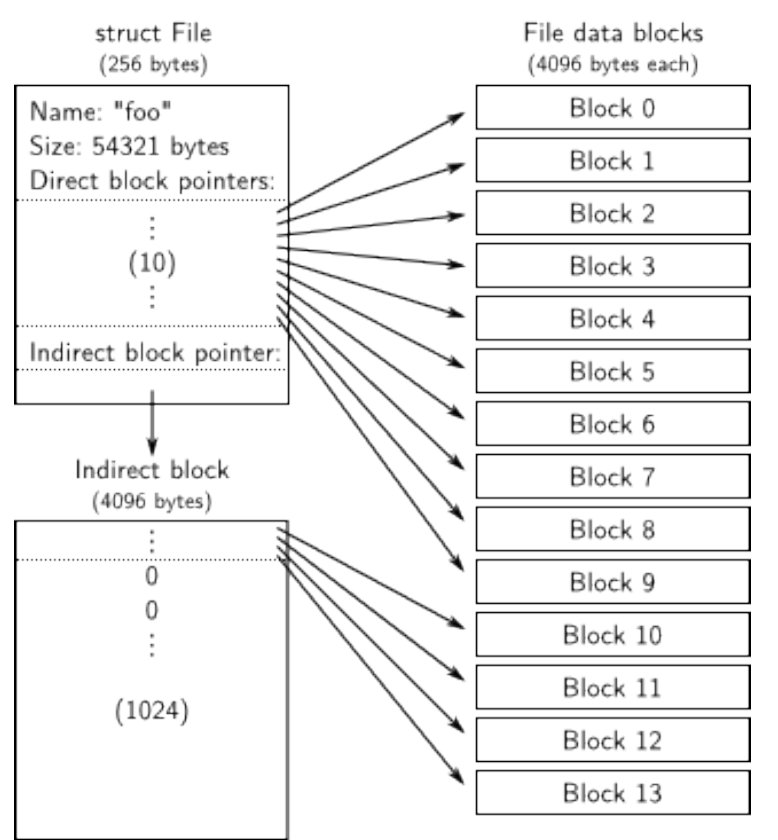

# 1. Boot up

## boot up steps
```c
 * BOOT UP STEPS
 *  * when the CPU boots it loads the BIOS into memory and executes it
 *
 *  * the BIOS intializes devices, sets of the interrupt routines, and
 *    reads the first sector of the boot device(e.g., hard-drive)
 *    into memory and jumps to it.
 *
 *  * Assuming this boot loader is stored in the first sector of the
 *    hard-drive, this code takes over...
 *
 *  * control starts in boot.S -- which sets up protected mode,
 *    and a stack so C code then run, then calls bootmain()
 *
 *  * bootmain() in this file takes over, reads in the kernel and jumps to it.
```


## 地址空间分布




## 1.1 BIOS

BIOS位于从 0xF0000到0x100000的64KB

### BIOS完成的工作:

- 系统初始化

- - 检查内存容量
  - ...

- BIOS从磁盘中读取boot loader并将控制移交给它.

### BIOS具体操作

```c
PC启动后 cs = 0xf000, ip = 0xfff0
BIOS执行的第一条指令就位于 cs << 4 + ip = 0xffff0处, BIOS结束位置16字节之前
[f000:fff0]    0xffff0:	ljmp   $0xf000,$0xe05b
ljmp 段选择子, 目标地址. 将cs设置段选择子, 将eip设置为目标地址

第一条指令跳转到 0xfe05b处(BIOS前半部分)继续执行

BIOS从硬盘中将boot loader所在的sector(512bytes)加载到内存0x7c00, 然后执行
jmp执行将CS:IP设为 0000:7c00, 将控制转移给boot loader
```



## 1.2 boot loader

### 从实模式切换到保护模式
**实模式**
- x86 处理器启动时的默认工作模式, 使用 20 位地址线，可以寻址的内存范围为 0 到 1MB。
- 在这个模式下，内存管理依赖于段寄存器（CS，DS，ES，SS）和偏移量的组合，每个段的大小最大为 64KB。
- 没有内存保护机制，任何程序都可以访问全部 1MB 的内存空间  

**保护模式**
- 使用 32 位地址线, 使用全局描述符表（GDT）和局部描述符表（LDT）来管理内存段
- 提供内存保护机制，每个程序都运行在一个独立的地址空间，无法直接访问其他程序或操作系统的内存  

**步骤**
1. 开A20地址总线
2. 设置GDT表, 代码段选择子为 0x8, 数据段选择子为0x10
   - GDT表共有3项, 第0项为空, 第1项为代码段, 第2项为数据段
   - 代码段和数据段的base都为0, limit都为0xffffffff
   - 段选择子格式:
     - \[0, 1\]: RPL
     - 2: TI(table indicator)
     - \[3, 15\]: 在对应描述符表中的索引
   - 所以代码段的索引为1, 数据段的索引为2
   
3. 将cr0最低位置为1, 表示开启保护模式
4. 跳到下一条指令, 下一条指令在32位模式下运行
5. 设置保护模式下的数据段寄存器

### 从磁盘中将内核读入内存

1. 从磁盘中读入一页(4KB)加载到物理地址ELFHDR(0x10000)
2. 检查ELF文件的魔数
3. 从ELF文件头得到段的数量和第一个段的起始地址
4. 按顺序从磁盘中将各个段读入内存
5. 跳转到ELFHDR->e_entry指向的指令处, 正式进入内核代码. 
   - `((void (*)(void)) (ELFHDR->e_entry))();`
   - 内核入口代码位于0x10000c处, 即内核从0x10000c处开始执行

> e_entry holds the link address of the entry point in the program: the memory address in the program's e_entry text section at which the program should begin executing.

### boot loader执行完后的内存分布



## 1.3 kernel

### entry.s
内核被链接到虚拟地址KERNBASE + 1MB, RELOC将链接地址映射到物理地址

- 设置cr3寄存器, 保存页目录物理地址

  - ```assembly
    movl  $(RELOC(entry_pgdir)), %eax
    movl   %eax, %cr3 // cr3 寄存器保存页目录表的物理基地址
    ```

    

- 设置cr0寄存器, 开启分页

  - ```assembly
    movl %cr0, %eax
    orl $(CR0_PE |  CR0_PG | CR0_WP), %eax
    movl %eax, %cr0
    ```

    

- 开启分页后, 跳到高地址

  - ```assembly
    mov	$relocated, %eax
    jmp	*%eax
    relocated:
    
    	# Clear the frame pointer register (EBP)
    	# so that once we get into debugging C code,
    	# stack backtraces will be terminated properly.
    	movl	$0x0,%ebp			# nuke frame pointer
    
    	# Set the stack pointer
    	movl	$(bootstacktop),%esp
    
    	# now to C code
    	call	i386_init
    ```
- 为预留的栈空间设置ebp和esp
  ```assembly
	movl	$0x0,%ebp			# nuke frame pointer

	# Set the stack pointer
	movl	$(bootstacktop),%esp

	# 在内核编译链接成的ELF文件中保留了KSTKSIZE字节的空间，作为栈使用
	.data
	###################################################################
	# boot stack
	###################################################################
		.p2align	PGSHIFT		# force page alignment
		.globl		bootstack
	bootstack:
		.space		KSTKSIZE
		.globl		bootstacktop   
	bootstacktop:
  ```
> **cr3**
> Typically, the upper 20 bits of CR3 become the *page directory base register* (PDBR), which stores the physical address of the first page directory. If the PCIDE bit in CR4 is set, the lowest 12 bits are used for the process-context identifier (PCID)


### 函数调用过程

1. 执行call指令前，**函数调用者**将参数入栈，按照**参数列表从右到左**的顺序入栈
2. call指令会自动将当前eip入栈，ret指令将自动从栈中弹出该值到eip寄存器
3. **被调用函数**负责：将ebp入栈，esp的值赋给ebp。所以反汇编一个函数会发现开头两个指令都是`push %ebp, mov %esp,%ebp`。


# 2. Memory management

## 当前内存分布



## 2.1 物理页及页目录初始化流程



### 物理页的管理


## 页表项 page table entry


### 虚拟地址转换为物理地址的过程


## 2.2 初始化内核空间
- 将UVPT映射到内核页目录的物理地址
- 设置内核栈, 将[KSTACKTOP - KSTKSIZE, KSTACKTOP)映射到`PADDR(boot_stack)`
  - 每个内核栈的下方有一块无效地址区域[KSTACKTOP - PTSIZE, KSTACKTOP - KSTKSIZE), 用于处理栈溢出. 这样发生stack overflow时, 会fault而不是改写有效地址. if the kernel overflows its stack, it will fault rather than overwrite memory.  Known as a "guard page".
```c
 *    KERNBASE, ---->  +------------------------------+ 0xf0000000      --+
 *    KSTACKTOP        |     CPU0's Kernel Stack      | RW/--  KSTKSIZE   |
 *                     | - - - - - - - - - - - - - - -|                   |
 *                     |      Invalid Memory (*)      | --/--  KSTKGAP    |
 *                     +------------------------------+                   |
 *                     |     CPU1's Kernel Stack      | RW/--  KSTKSIZE   |
 *                     | - - - - - - - - - - - - - - -|                   |
 *                     |      Invalid Memory (*)      | --/--  KSTKGAP    |
 *                     +------------------------------+                   |
```
- 将UPAGES映射到pages数组的物理地址
- 将UENVS映射到envs数组的物理地址
- 将虚拟地址[KERNBASE, 2&32)映射到物理地址[0, 2^32 - KERNBASE)
- 将cr3寄存器设置为`PADDR(kern_pgdir)`
- 设置cr0寄存器


## 2.3 实现核心功能的函数

### pgdir_walk() 

从虚拟地址得到页表项, 即物理地址和访问权限

```c
pte_t* pgdir_walk(pde_t *pgdir, const void *va, int create){
	pde_t* pde = pgdir + PDX(va); // va >> 22 得到va在页目录表中的下标
	if (!((*pde) & PTE_P)) { // 如果该项不存在
		if (create) { // 创建页目录项
			struct PageInfo* new_pg_table = page_alloc(1);// 分配一个物理页, 初始化为'\0'
			if (new_pg_table == NULL)
				return NULL;
			new_pg_table->pp_ref += 1;
			*pde = page2pa(new_pg_table) | PTE_U | PTE_P | PTE_W; // 
		} else {
			return NULL;
		}
	}
	return (pte_t*)KADDR(PTE_ADDR(*pde)) + PTX(va);
}
```


### page_insert()

将一个虚拟地址映射到一个物理页

```c
int page_insert(pde_t *pgdir, struct PageInfo *pp, void *va, int perm)
{
	pte_t* pte = pgdir_walk(pgdir, va, 1);
	if (pte == NULL) {
		return -E_NO_MEM;
	}
	pp->pp_ref += 1; 

	physaddr_t pa = page2pa(pp);
	if ( (*pte) & PTE_P ) { // 该虚拟地址已被映射到其它物理地址
		page_remove(pgdir, va); // 解除映射
	}
	*pte = pa | perm | PTE_P; // 将va映射到pa

	return 0;
}
```


### page_remove()

 解除一个虚拟地址的映射.

```c
void page_remove(pde_t *pgdir, void *va) {
	pte_t* pte;
	struct PageInfo* pg = page_lookup(pgdir, va, &pte); // 从页表中查找va对应的物理页, 并将对应的页表项的地址赋给pte
	if (pg == NULL)
		return;
	page_decref(pg); // 物理页引用计数减1, 到0则将该物理页加到page_free_list
	*pte = 0; // 清除页表项
	tlb_invalidate(pgdir, va); // 在TLB中删除该映射

}
```
## 2.4 最终虚拟地址到物理地址的映射


# 3. 用户级进程
## 系统调用

系统调用的完成流程：以user/hello.c为例，其中调用了cprintf()，注意这是lib/print.c中的cprintf，该cprintf()最终会调用lib/syscall.c中的sys_cputs()，sys_cputs()又会调用lib/syscall.c中的syscall()，该函数将系统调用号放入%eax寄存器，五个参数依次放入in DX, CX, BX, DI, SI，然后**执行指令int 0x30，执行了`0x30`后或者发生异常（比如除0），都会直接跳到trapentry.s中**。 发生中断后，去IDT中查找中断处理函数，最终会走到kern/trap.c的trap_dispatch()中，我们根据中断号0x30，又会调用kern/syscall.c中的syscall()函数（注意这时候我们已经进入了内核模式CPL=0），在该函数中根据系统调用号调用kern/print.c中的cprintf()函数，该函数最终调用kern/console.c中的cputchar()将字符串打印到控制台。当trap_dispatch()返回后，trap()会调用`env_run(curenv);`，该函数前面讲过，会将curenv->env_tf结构中保存的寄存器快照重新恢复到寄存器中，这样又会回到用户程序系统调用之后的那条指令运行，只是这时候已经执行了系统调用并且寄存器eax中保存着系统调用的返回值。任务完成重新回到用户模式CPL=3。


```bash
// 异常处理
(gdb) info r
eax            0x1	1
ecx            0x0	0
edx            0x0	0
ebx            0x802000	8396800
esp            0xeebfdfb0	0xeebfdfb0
ebp            0xeebfdfc0	0xeebfdfc0
esi            0x802030	8396848
edi            0x0	0
eip            0x80005b	0x80005b
eflags         0x16	[ PF AF ]
cs             0x1b	27
ss             0x23	35
ds             0x23	35
es             0x23	35
fs             0x23	35
gs             0x23	35
(gdb) si
=> 0x80005c:	idiv   %ecx
0x0080005c in ?? ()
(gdb) info r
eax            0x1	1
ecx            0x0	0
edx            0x0	0
ebx            0x802000	8396800
esp            0xeebfdfb0	0xeebfdfb0
ebp            0xeebfdfc0	0xeebfdfc0
esi            0x802030	8396848
edi            0x0	0
eip            0x80005c	0x80005c
eflags         0x16	[ PF AF ]
cs             0x1b	27
ss             0x23	35
ds             0x23	35
es             0x23	35
fs             0x23	35
gs             0x23	35
(gdb) x/20x 0xEFFFFFEC
0xefffffec:	0x00800bf6	0x0000001b	0x00000016	0xeebfdfc4
0xeffffffc:	0x00000023	0xf000ff53	0xf000ff53	0xf000e2c3
0xf000000c:	0xf000ff53	0xf000ff53	0xf000ff53	0xf000ff53
0xf000001c:	0xf000ff53	0xf000fea5	0xf000e987	0xf000d62c
0xf000002c:	0xf000d62c	0xf000d62c	0xf000d62c	0xf000ef57
(gdb) si
=> 0xf01042b8 <th0+2>:	push   $0x0
0xf01042b8 in th0 () at kern/trapentry.S:50
50		TRAPHANDLER_NOEC(th0, 0)
(gdb) x/20x 0xEFFFFFEC
0xefffffec:	0x0080005c	0x0000001b	0x00000016	0xeebfdfb0
0xeffffffc:	0x00000023	0xf000ff53	0xf000ff53	0xf000e2c3
0xf000000c:	0xf000ff53	0xf000ff53	0xf000ff53	0xf000ff53
0xf000001c:	0xf000ff53	0xf000fea5	0xf000e987	0xf000d62c
0xf000002c:	0xf000d62c	0xf000d62c	0xf000d62c	0xf000ef57
(gdb) info r
eax            0x1	1
ecx            0x0	0
edx            0x0	0
ebx            0x802000	8396800
esp            0xefffffe8	0xefffffe8
ebp            0xeebfdfc0	0xeebfdfc0
esi            0x802030	8396848
edi            0x0	0
eip            0xf01042b8	0xf01042b8 <th0+2>
eflags         0x16	[ PF AF ]
cs             0x8	8
ss             0x10	16
ds             0x23	35
es             0x23	35
fs             0x23	35
gs             0x23	35

```


发生中断时(系统调用时的显式调用`int 0x30`以及异常)，cpu都会将ss, esp, eflags, cs, eip入栈。

异常（比如除0）不会返回，相应进程会被destroy

系统调用会返回。系统调用结束后，env_run(curenv) --> env_pop_tf()恢复原进程cpu状态。其中iret会从栈中弹出eip, cs, eflags, esp, ss.


# 开启多CPU及抢占式多任务调度


## 实现**进程调度**算法。 

一种是非抢占式式的，另一种是抢占式的，借助时钟中断实现，时钟中断到来时，内核调用sched_yield()选择另一个Env结构执行。

## 实现写时拷贝fork（**进程创建**）。

fork()是库函数，会调用sys_exofork(void)这个系统调用，该系统调用在内核中为子进程创建一个新的Env结构，然将父进程的寄存器状态复制给该Env结构，复制页表，对于PTE_W为1的页目录，复制的同时，设置PTE_COW标志。为父进程和子进程设置缺页处理函数，处理逻辑：当缺页中断发生是因为写写时拷贝的地址，分配一个新的物理页，然后将该虚拟地址映射到新的物理页。
原理总结如下：

### fork具体过程

- 父进程调用fork()

  - 由用户态切换到内核态:

    - 保存当前进程执行状态, 包括CPU信息(寄存器: cs, ip, sp...), 将这些信息压入内核栈中, 以便从内核态返回时恢复状态并从下一条指令继续执行

  - 进入内核态后, 内核分配一个新的env/pcb结构来表示创建的子进程

    - env/pcb复制一些父进程的信息, 包括寄存器信息trapframe, 内存映射(也可在系统调用返回时通过别的系统调用来复制映射)等.

    - 分配一个新的进程id给新创建的进程

    - 如果已经分配运行所需的所有资源(内存映射等), 可将子进程设置为runnable

    - 否则设置为unrunnable, 等待得到内存分配后再设置为runnable

    - 创建完毕后, 系统调用返回到调用进程(父进程), 返回值为子进程的id

      - 从内核栈中依次弹出保存的状态到各个寄存器中, cs, ip, sp, eax...
      - 并继续执行下面的指令

    - 子进程由于复制了父进程的信息, ip寄存器可指明子进程开始执行的位置. 子进程的返回值0是通过创建pcb/env时将子进程的trapframe中的eax设置为0. 而判断fork()返回值pid的汇编指令为test %eax, %eax 

      - ```c
        if (pid == 0) { // test %eax, %eax . eax为0时, 将相关flag置为1, 即执行 if (pid == 0)里的指令
            // child process
        } else {
            // parent(current) process, the process that called fork
        }
        ```

      - 

    - 子进程被调度时, 从子进程pcb/env中的trapframe得到执行状态(eax == 0, ip为父进程调用fork的下一条指令), 开始执行. 

## 实现**进程间通信**。

本质还是进入内核修改Env结构的的页映射关系。原理总结如下：


# 文件系统
文件系统通过一个专门的文件系统服务进程`fsenv`来实现。
## 普通进程操作文件过程

env调用相应dev指定的文件 操作函数， 该函数生成一个fsipc， 将请求号保存在val中，具体请求（文件id，操作的字节的数量，接收响应的buffer地址..）保存在fsipcbuf中，将该页共享给fsenv，向fsenv发送ipc。

fsenv一直执行ipc_recv，接收到其他env的文件操作请求，从val和共享的页获得请求号和请求具体信息，执行处理该请求号的处理函数，处理完毕后，通过ipc_send将结果发给请求env


## blocks of hard disk





## file meta-data: `struct File` in inc/fs.h



To support larger files, "real" file systems typically support double- and
triple-indirect blocks as well.

## block cache

Of course, it would take a long time to read the entire disk into memory, so instead we'll implement a form of **demand** **paging**, wherein we only allocate pages in the disk map region and read the corresponding block from the disk in response to
a page fault in this region. This way, we can pretend that the entire disk is in memory.

## FS env

FS env将整个disk映射到自己的内存空间`[DISKMAP, DISKMAP + DISKMAX), i.e.[0x1000000, 0x1000000 + 3GB)`. 将整个磁盘全部读到内存将非常耗时，所以我们将实现按需加载，只有当访问某个block对应的内存地址时出现页错误，才将该block从磁盘加载到对应的内存区域(通过`bc_pgfault()`)，然后重新执行内存访问指令。

文件系统进程只要访问虚拟内存[DISKMAP, DISKMAP+DISKMAX]范围中的地址addr，就会访问到磁盘((uint32_t)addr - DISKMAP) / BLKSIZE block中的数据。如果block数据还没复制到内存物理页，bc_pgfault()缺页处理函数会将数据从磁盘拷贝到某个物理页，并且将addr映射到该物理页。这样FS进程只需要访问虚拟地址空间[DISKMAP, DISKMAP+DISKMAX]就能访问磁盘了。


## RPC via IPC

文件系统服务端代码在fs/serv.c中，serve()中有一个无限循环，接收IPC请求，将对应的请求分配到对应的处理函数，然后将结果通过IPC发送回去。
对于客户端来说：发送一个32位的值作为请求类型，发送一个Fsipc结构作为请求参数，该数据结构通过IPC的页共享发给FS进程，在FS进程可以通过访问fsreq(0x0ffff000)来访问客户进程发来的Fsipc结构。
对于服务端来说：FS进程返回一个32位的值作为返回码，对于FSREQ_READ和FSREQ_STAT这两种请求类型，还额外通过IPC返回一些数据。


## spawn()

ib/spawn.c中的spawn()创建一个新的进程，从文件系统加载用户程序，然后启动该进程来运行这个程序。spawn()就像UNIX中的fork()后面马上跟着exec()。
`spawn(const char *prog, const char **argv)`做如下一系列动作：

1. 从文件系统打开prog程序文件
2. 调用系统调用sys_exofork()创建一个新的Env结构
3. 调用系统调用sys_env_set_trapframe()，设置新的Env结构的Trapframe字段（该字段包含寄存器信息）。
4. 根据ELF文件中program header，将用户程序以Segment读入内存，并映射到指定的线性地址处。
5. 调用系统调用sys_env_set_status()设置新的Env结构状态为ENV_RUNNABLE。

## 父子进程共享文件描述符Fd

我们希望**共享文件描述符**，JOS中定义PTE新的标志位**PTE_SHARE**，如果有个页表条目的PTE_SHARE标志位为1，那么**这个PTE在fork()和spawn()中将被直接拷贝到子进程页表**，从而让**父进程和子进程共享相同的页映射关系，从而达到父子进程共享文件描述符的目的。**


